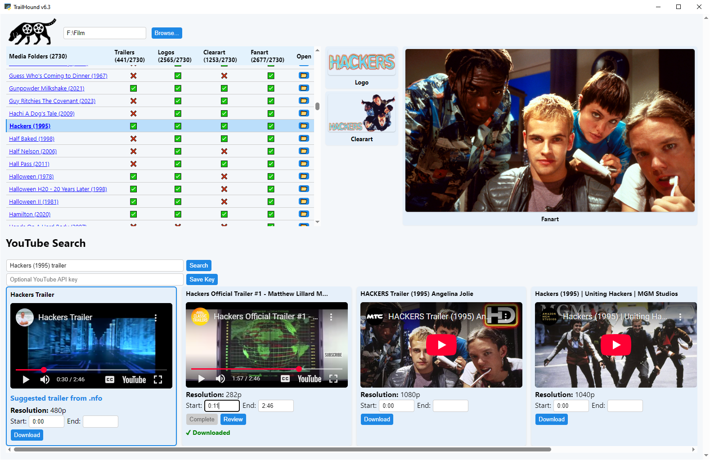

<p align="left">
  
</p>

#    TrailHound

TrailHound is a simple desktop tool to help you **check your local media folders for missing trailers and download them from YouTube**.

It uses [`yt-dlp`](https://github.com/yt-dlp/yt-dlp) behind the scenes to handle searches, downloads, and trimming. You can also optionally use your own YouTube API key for faster searching.

---



## ✨ Features

- ✅ **Scans your media folders for missing trailers**
- 🔎 **Searches YouTube** (via API key or using yt-dlp scraping if no key is provided)
- 🎥 **Downloads and optionally trims trailers using yt-dlp**
- 🚫 **Mark folders as "no trailer"** to skip them in future scans
- 🖼️ **Bonus**: Displays any existing local artwork (logo, clearart, fanart) and links out to TVDB artwork pages if you need more images

---

## 🚀 Installation

### ✅ Windows (recommended)

1. Download the latest `release.zip` from [Releases](../../releases).
2. Unzip it anywhere you like.
3. Make sure `trailhound.exe`, `yt-dlp.exe`, and `index.html` are all in the same folder.
4. Double-click `trailhound.exe`.

---

<details>
<summary>💻 Python source version (for advanced users)</summary>

### Requirements

- Python 3.9 or newer
- [`yt-dlp`](https://github.com/yt-dlp/yt-dlp) installed and on your PATH

### Install Python dependencies

```
pip install -r requirements.txt
```

### Install yt-dlp

```
pip install -U yt-dlp
```

### Run

```
python trailhound.py
```

</details>

---

## 🔑 YouTube API key (optional)

Using a YouTube API key is optional but recommended for smoother, faster searches. Its free, easy and only takes 30 seconds and 5 clicks:

<details>
<summary>How to get a YouTube API key</summary>

1. Go to [Google Cloud Console](https://console.cloud.google.com/).
2. Create or select a project.
3. Enable **YouTube Data API v3**.
4. Create credentials → API key.
5. Copy your key, paste it into TrailHound using the "Save API Key" button. It will auto-fill the next time you open the program.

</details>

---

## 📝 License

TrailHound is licensed under the MIT License.  
See [LICENSE](./LICENSE) for details.

---
